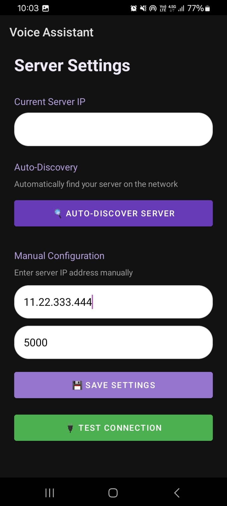

# Smart Voice Assistant

A local voice assistant powered by LLaMA 3.1 for daily task management. All conversations include timestamps for accurate time-based operations like alarms and reminders. The system runs entirely on your local network for complete privacy.


## Features

### Voice Interaction
- Real-time speech recognition with live word display
- Text-to-speech responses
- Google Assistant-inspired UI with pulsating animations
- Both voice and text input supported


### Smart Alarm System
- Natural language alarm setting ("wake me up in 30 minutes", "set alarm for tomorrow at 8 AM")
- Automatic time calculation with current time context
- Full-screen alarm notifications with custom ringtone
- Every message includes timestamp (DD/MM/YYYY HH:MM) for accurate scheduling

**Benefits:** Never worry about time confusion - the AI always knows the current time and calculates alarms accurately.


### Note Taking
- Voice or text note creation
- All notes automatically timestamped
- Edit, delete, and export notes to text file
- Persistent local storage


### Privacy-First Design
- 100% local operation - no cloud services
- All AI processing on your local network
- No data collection or tracking
- Complete control over your data

### Network Configuration
- Auto-discovery finds server automatically on your network
- Manual IP/Port configuration available
- Connection testing built-in
- Settings persist across sessions



## System Requirements

**Android Device:**
- Android 8.0 (API 26) or higher
- Microphone permission
- WiFi connection

**Server (PC/Laptop):**
- Python 3.8+
- Ollama with LLaMA 3.1 model
- 8GB RAM minimum (16GB recommended)
- ~5GB storage for LLaMA model

## Installation

### 1. Setup Server

```bash
cd PCpart

# Create virtual environment (recommended)
python -m venv venv
venv\Scripts\activate  # Windows
# source venv/bin/activate  # macOS/Linux

# Install dependencies
pip install -r requirements.txt

# Install Ollama from https://ollama.ai/download
# Then pull LLaMA model
ollama pull llama3.1

# Start server
python reciver.py
```

Server will run on `http://0.0.0.0:5000`

### 2. Setup Android App

1. Open `Voice Asistant` folder in Android Studio
2. Sync Gradle (wait for dependencies to download)
3. Connect Android device or start emulator
4. Build and run

Grant permissions when prompted:
- Microphone (for voice input)
- Notifications (for alarms)
- Exact alarms (for precise scheduling)

### 3. Configure Connection

**Auto-Discovery (Recommended):**
1. Ensure phone and PC on same WiFi
2. Open app → Settings (⚙️)
3. Tap "Auto-Discover Server"
4. Tap "Save Settings"

**Manual Configuration:**
1. Find PC's IP address (`ipconfig` on Windows, `ifconfig` on Mac/Linux)
2. In app Settings, enter IP and port (5000)
3. Save and test connection

## Usage

### Conversations
- **Text:** Type message and tap send
- **Voice:** Tap "Speak" button and speak naturally

All messages automatically include current time for context.

### Setting Alarms
Examples:
- "Set an alarm in 30 minutes"
- "Wake me up at 7 AM tomorrow"
- "Remind me in 2 hours"

The AI calculates exact alarm time using the timestamp in your message.

### Taking Notes
Examples:
- "Take note: Buy groceries"
- "Remember I have a meeting at 2 PM"
- "Save note: Call John about project"

View notes by tapping "Show Notes" button. Export to text file anytime.

## Project Structure

```
Smart Assistant/
├── Voice Asistant/                    # Android App
│   ├── app/src/main/java/com/example/voicechatapp/
│   │   ├── MainActivity.kt            # Main UI, TTS/STT
│   │   ├── ChatManager.kt             # Message handling
│   │   ├── SettingsActivity.kt        # Server configuration
│   │   ├── NotesActivity.kt           # Notes management
│   │   ├── AlarmHelper.kt             # Alarm scheduling
│   │   ├── AlarmReceiver.kt           # Alarm broadcast
│   │   └── VoiceRecordingDialog.kt    # Voice UI
│   └── app/build.gradle.kts           # Dependencies
│
├── PCpart/
│   ├── reciver.py                     # Flask server + LLaMA 3.1
│   └── requirements.txt               # Python dependencies
│
├── .gitignore
└── README.md
```

## Architecture

### Android App (Kotlin)
- **MVVM pattern** for clean architecture
- **OkHttp** for networking (120s timeout for LLM responses)
- **Android SpeechRecognizer** for voice input
- **TextToSpeech API** for voice output
- **SharedPreferences** for data persistence
- **RecyclerView** for efficient chat display

### Python Server
- **Flask** web framework with CORS
- **Ollama** for LLaMA 3.1 integration
- Maintains conversation history (up to 50 messages)
- Special command parsing:
  - `XX1 DayName/YYYY-MM-DD/HH:MM` → Alarm
  - `XX2 [content]` → Note

## Dependencies

### Android
```kotlin
implementation "androidx.core:core-ktx:1.16.0"
implementation "com.google.android.material:material:1.11.0"
implementation "com.squareup.okhttp3:okhttp:4.12.0"
implementation "com.google.code.gson:gson:2.10.1"
implementation "org.apache.poi:poi:5.2.3"  // For note export
```

### Python
```
Flask==3.0.0
flask-cors==4.0.0
ollama==0.1.0
```

## Troubleshooting

### Can't Connect to Server
1. Verify server is running (check terminal)
2. Confirm both devices on same WiFi
3. Check firewall (allow Python through)
4. Try manual IP configuration

### Voice Recognition Not Working
1. Grant microphone permission
2. Check internet connection (some devices need it for STT)
3. Speak clearly with minimal background noise

### Alarm Issues
1. Grant "Exact alarms" permission (Android 12+)
2. Check Do Not Disturb settings
3. Ensure device isn't in power-saving mode

### Slow Responses
- First request takes longer (model loading)
- Try smaller model: `ollama pull llama3.1:8b`
- Close other applications on server PC

## API Documentation

### POST `/receive`
**Request:**
```
Content-Type: multipart/form-data
message: "Your message [Current time: 15/01/2025 14:30 (Monday)]"
```

**Response:**
```json
{
  "response": "AI response or special command"
}
```

**Special Commands:**
- `XX1 Monday/2025-01-15/15:00` → Set alarm
- `XX2 Note content` → Save note
- Plain text → Normal conversation

### POST `/reset`
Clears conversation history.

## Configuration

### Change Server Settings
Edit [reciver.py](PCpart/reciver.py):
```python
MODEL_NAME = "llama3.1"  # Change model
PORT = 5000              # Change port
```

### Change Android Timeouts
Edit [MainActivity.kt](Voice Asistant/app/src/main/java/com/example/voicechatapp/MainActivity.kt):
```kotlin
.connectTimeout(30, TimeUnit.SECONDS)
.readTimeout(120, TimeUnit.SECONDS)  // LLM response timeout
```

## Why Local?

| Feature | This Project | Cloud Assistants |
|---------|--------------|------------------|
| Privacy | Complete | Limited |
| Internet | Only for setup | Always required |
| Cost | Free | Often subscription |
| Data Control | You own it | Stored remotely |
| Customization | Full | Limited |

## License

MIT License - see below for details.

```
MIT License

Copyright (c) 2025 [Your Name]

Permission is hereby granted, free of charge, to any person obtaining a copy
of this software and associated documentation files (the "Software"), to deal
in the Software without restriction, including without limitation the rights
to use, copy, modify, merge, publish, distribute, sublicense, and/or sell
copies of the Software, and to permit persons to whom the Software is
furnished to do so, subject to the following conditions:

The above copyright notice and this permission notice shall be included in all
copies or substantial portions of the Software.

THE SOFTWARE IS PROVIDED "AS IS", WITHOUT WARRANTY OF ANY KIND, EXPRESS OR
IMPLIED, INCLUDING BUT NOT LIMITED TO THE WARRANTIES OF MERCHANTABILITY,
FITNESS FOR A PARTICULAR PURPOSE AND NONINFRINGEMENT. IN NO EVENT SHALL THE
AUTHORS OR COPYRIGHT HOLDERS BE LIABLE FOR ANY CLAIM, DAMAGES OR OTHER
LIABILITY, WHETHER IN AN ACTION OF CONTRACT, TORT OR OTHERWISE, ARISING FROM,
OUT OF OR IN CONNECTION WITH THE SOFTWARE OR THE USE OR OTHER DEALINGS IN THE
SOFTWARE.
```

## Acknowledgments

- [Ollama](https://ollama.ai/) - Local LLM hosting
- [Meta AI](https://ai.meta.com/) - LLaMA 3.1 model
- [Material Design](https://material.io/) - UI guidelines

---

**Made with privacy and productivity in mind.**
